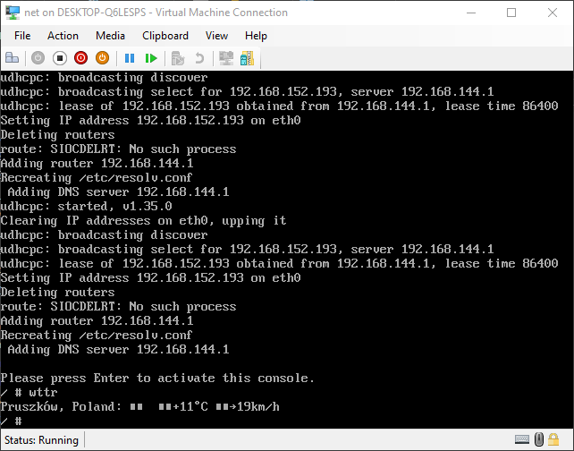

# Linux Net ISO

## Purpose
Minimal bootstrapable Linux distribution with working internet.

## Running
In order to build ISO you will need following programs:
bash, gcc, flex, bison, mkisofs, find, gzip, strip, cpio, make, mkdir, cp, wget

## Usage
This solution is targeting Microsoft Hyper-V

### Configuration
Preffered VM settings:
- Bios: Boot from CD
- Memory: 64 MB
- Processor: 1 Virtual processor
- IDE Controller:
    - DVD Drive
    - Image: ISO file
- Network Adapter: Default switch. Exteral switch can also be used.

## Result

## Software used
- Linux kernel 5.10.17
- busybox:
    - contains necessary system and networking tools
    - built using bootlin uclibc toolchain
- isolinux:
    - creating bootable iso image

## Project structure
| file/directory | description |
|----------------|-------------|
| ./bundles      | build scripts for software used by the distribution |
| ./config       | build config files for bundles |
| ./rootfs       | root directory tree of the target iso, all files residing in this tree will be copied (excluding .keep files) |

